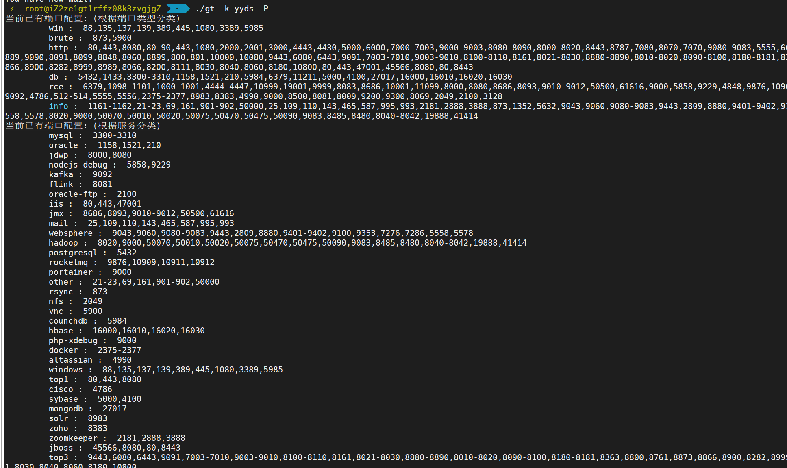

# Getitle
一个资产探测扫描器. 

README Version 1.0.0

## Usage

```
Usage of ./getitle:
  -d int       超时,默认2s (default 2)
  -ip string   IP地址 like 192.168.1.1/24
  -m string    扫描模式：default ,s(启发式),f(每个C段第一个ip) ,a(auto,内网三个网段,默认为icmp扫描,如要启用socket请指定-n socket)(每次只能选择一个生效)
  -p string    ports (default "top1")
  -sp string   smart probe,启发式扫描端口探针,默认icmp
  -ipp string  ip probe,-ss模式ip探针,默认1
  -s bool 	   喷洒模式扫描,ip生成器将端口为优先,端口数量大于100将自动启用
  -ns bool	   强制关闭spray扫描
  -t int       threads (default 4000)
  -o string    输出格式:clean,full(default) or json
  -f string    输出文件名,默认为空,请用相对路径(./)或绝对路径
  -af bool	   自动生成文件名,格式为 ".IP_port_number.json"
  -v bool      扫描详细指纹.默认为打开状态,存在-v参数则关闭.
  -e bool      启用漏洞插件扫描,目前有ms17-010与shiro(默认key),以及nuclei的poc,将会自动选用
  -E string    强制指定poc的tag,name
  -k string    启动密码(必须输入)为ybb  
  -l string    从文件中读取任务,例如:-l ip.txt
  -j string	   从输出的json中读取任务,例如:-j 1.json
  -P string    查看配置预设  port|nuclei|inter 
  -F file      格式化json
  -no bool	   高级扫描模式只探测存活网段不进行端口扫描

```

## 使用
最简使用

`gt -k [key] -ip 192.168.1.1/24 -p top2,top3 `

进阶扫描

`gt -k [key] -ip 192.168.1.1/24 -p top2,win -e -v`

网段发现

B段启发式扫描

`gt -k [key] -ip 10.0.0.0/16 -m s -p top2,win -e -v`

A段启发式扫描

`gt -k [key] -ip 10.0.0.0/8 -m ss -p top2,win -e -v`

内网存活主机启发式探测

`gt -k [key] -ip 10.0.0.0/8 -m ss -p icmp`


## 参数解释

所有用法都需输入-k [密钥]

### IP输入

当前支持三种输出形式:

1. 直接输入cidr,参数-ip 1.1.1.1/24
2. 从文件中读ip列表, 参数 -l 1.txt
3. 从结果中读任务列表,参数 -j 1.json

### 端口配置

gt支持非常灵活的端口配置

参看端口预设,参数 -P

使用端口预设灵活配置端口: -p top2,http,1-1000,65534


### 输出

输出分为连大类,输出到文件或输出到命令行.在webshell场景下,通常无法输出到命令行.

#### 输出到命令行

默认即可输出到命令行,但是在选择输出到文件的时候会关闭命令行输出.此时可以使用-c手动开启

输出到命令行的格式可以使用-o参数控制,默认为full,可以选择json,c(color,着色),未来将支持输出其他工具的格式

#### 输出到文件

输出格式与输出到命令行相同,不同需要使用-O参数控制, 默认为json.可以手动指定-O full修改为命令行式的输出

#### 格式化JSON

-F 参数可以格式化JSON,拥有比full更加整洁与美化的输出结果.

还可以使用`-F 1.json -o c`来着色


### 启发式扫描配置

-m s 为喷洒C段模式,子网掩码要小于24才能使用

-m ss 为喷洒B段模式, 子网掩码要小于16才能使用

-s 为端口的spray模式,打开后将使用同一个端口与每个IP组合,防止同一个IP的请求过多造成漏报. 此参数支持-l 从文件中输入


-no 只进行启发式扫描,在喷洒到网段后不进行全扫描. 可以配合-f参数将启发式扫描喷洒到的网段输出到文件.例如 `-s -no -f aliveC.txt`

-sp (smart probe)控制启发式扫描的探针,默认为icmp协议,可以手动指定为其他配置,例如`-sp 80,icmp,445 ` 来在禁ping的环境下使用

-ipp (IP probe) 控制-ss模式中的B段喷洒的ip探针,-ss模式默认只扫描每个C段的第一个ip,例如192.168.1.1. 可以手动修改,指定`-ipp 1,254,253`

### 其他配置

-t 设置线程数,linux默认4000,windows默认20000

-d tcp与http协议的超时时间,默认2s

-D 单独指定https协议的超时时间,默认4s


### 进阶扫描

默认只进行被动的指纹探测,即只进行一次http交互

-v 会进行主动发包的指纹探测

-e 进行漏洞探测,目前只是个demo,未来将会支持xray,goby的poc


## 使用场景

#### 扫描C段的关键端口

`./gt.exe -ip 192.168.1.1/24 -p top2`

#### 扫描启发式扫描B段或大于B段

`./gt.exe -ip 172.16.1.1/12 -p top2 -m s`

#### 写入到文件

写入到文件的数据为json,需要配合-F参数格式化,(写入到文件则默认命令行只输出进度)

`./gt.exe -ip 172.16.1.1/12 -p top2 -m s -f out.txt`

#### 格式化json输出

`./gt.exe -F out.txt`

启发式扫描只会先扫描80端口,如果在该C段中扫描到了80端口,则进行已配置端口的完整扫描.加快扫描速度.

#### 使用端口预设

`./gt -P`



根据类型名或者服务名自由组合端口(会自动去重),例如

`./gt.exe -ip 172.16.1.1/24 -p top2,db,mail,jboss,1000-1009,12345,54321`

#### 端口Spray模式

端口优先的喷洒

`./gt.exe -ip 172.16.1.1/24 -p top2 -s`

#### 指纹识别

当前包括一百多条CMS指纹以及数十条favicon指纹.

默认只收集不主动发包的指纹.

用法:

`./gt.exe -ip 192.168.1.1/24 -p top2`

需要主动发包探测指纹或漏洞,例如redis,memcache

`./gt.exe -ip 192.168.1.1/24 -p top2 -v `

#### 漏洞探测

getitle并非漏扫工具,因此不会支持sql注入,xss之类的漏洞探测功能.

当前漏洞只能针对简单的http或tcp连接交互实习.

当前支持漏洞:

shiro(默认key)

ms17-010

`./gt.exe -ip 192.168.1.1/24 -p top2 -e`

#### 高级启发式扫描

喷洒B段

`./gt -m ss -ip 10.0.0.0/8 -no`

喷洒C段

`./gt -m s -ip 10.0.0.0/16 -no -f aliveC.txt`

自动内网网段扫描,扫描全内网所有C段第一个ip,默认为icmp协议

`./gt.exe -m a -no`

首ip网段探测,可通过-n 指定,默认为socket,例如:

`gt.exe -ip 59.1.1.1/8 -m f`

指定为首ip探测模式 icmp协议

`gt.exe -ip 59.1.1.1/8 -m f -n icmp`


#### 特殊扫描端口

当前包括三个特殊扫描端口(能够和其他端口配置组合不冲突)

OXID:

`./gt.exe -ip 172.16.1.1/24 -p 135`

NBTScan

`./gt.exe -ip 172.16.1.1/24 -p 137`

PING

`./gt.exe -ip 172.16.1.1/24 -p icmp`

snmp

`./gt.exe -ip 172.16.1.1/24 -p snmp`


### 注意事项

* **(重要)**因为并发过高,性能限制主要来自路由器设备.因此**建议在阿里云,华为云等vps上使用**,如果扫描国外资产,建议在国外vps上使用.本地使用如果网络设备性能不佳会带来大量丢包.

* 如果使用中发现疯狂报错,大概率是io问题(例如多次扫描后io没有被正确释放,或者配合proxifier以及类似代理工具使用报错),可以通过重启电脑,或者虚拟机中使用,关闭代理工具解决.如果依旧无法解决请联系我们.

* 还需要注意,upx压缩后的版本虽然体积小,但是有可能被杀软杀,也有可能在部分机器上无法运行.

* 一般情况下无法在代理环境中使用,除非使用-t参数指定较低的速率(默认协程池为4000).


## 配置指纹识别

指纹的json位于`src\Utils\finger.json`.

为了保证单文件可使用,将会在运行gox.bat时将json中的数据写到`src\Utils\finger.go`中

配置示例:

```
[    
	{
        "name": "Mysql_unauthorized",
        "level": 0,
        "defaultport": "3306",
        "regexps": [
            "Host .* is not allowed to connect to this MySQL server"
        ]
    }
]
```

`name`为规则名,string,请保证不重名

`level`为优先级,int,最高优先级为0

`defaultport`为该服务默认端口,string,用作提高匹配速度

`regexps`为正则列表,[]string, 默认为数组,同一规则可以配置多个正则依次匹配

### 注意事项

* json不接受`\x00`,`\0`等转义,请将类似转义修改成`\u0000`.

* 请注意数组元素间的逗号,否则可能导致json报错

## Makefile

 * make release VERSION=VERSION to bulid getitle to all platform

 * Windows build muli releases

### windows requirement:
 * upxs 自定义修改版的upx壳,可以在gox.bat中替换成原版
 * limelighter 签名伪造工具
 * tar.exe 压缩打包工具
 * gox go语言快捷编译工具
 * go-strip go语言编译信息去除工具

   ```
   gox.bat [version] # .e.g gox.bat 0.3.0
   ```

   

## THANKS

* https://github.com/Tylous/Limelighter
* https://github.com/boy-hack/go-strip
* https://github.com/k8gege/LadonGo

    