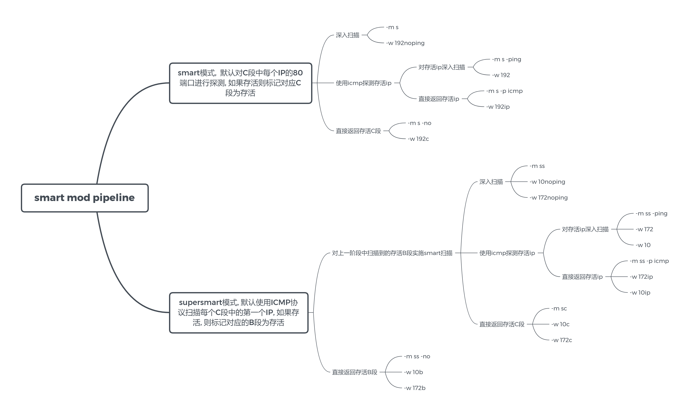

# gogo
高度可控可拓展的自动化的扫描引擎

README Version 2.5.0

## QuickStart
最简使用, 指定网段进行默认扫描, 并在命令行输出

`gogo -i 192.168.1.1/24 -p win,db,top2 `

当目标范围的子网掩码小于24时, 建议启用 smart模式扫描(原理见doc), 例如子网掩码为16时(输出结果较多, 建议开启--af输出到文件, 命令行只输出日志)

`gogo -i 172.16.1.1/16 -m s -p top2,win,db --af`

这个命令有些复杂, 但不用担心, 可以使用workflow代替.如 `gogo -w s -i 172.16.1.1/16`, --af的意思为自动生成文件, 使用-w时为自动开启.

当目标范围的子网掩码小于24, 建议启用 supersmart模式扫描, 例如:

`gogo -i 10.0.0.0/8 -m ss -p top2,win,db --af`

常用的配置已经被集成到workflow中, 例如使用supersmart mod 扫描10段内网, `gogo -w 10`即可. 如果需要自定义网段, 则是`gogo -w 10 -i 11.0.0.0/8`, 通过-i参数覆盖-w 10 中的ip字段. 因为语义可能造成混淆, 也可以使用语义化的workflow `gogo -w ss -i 11.1.1.1/8`.

workflow中的预设参数优先级低于命令行输入, 因此可以通过命令行覆盖workflow中的参数. 除了-i, 其他与扫描相关的参与均可以覆盖.

可以使用`-P workflow`查看所有的workflow预设, 更快捷的使用gogo.

如果指定了--af或者-w, 默认的输出结果为deflate算法压缩后的json文件, 可以使用-F格式化扫描结果

`gogo -F result.dat`


### workflow
workflow 使用思维导图



## 参数详解
gogo的参数相当复杂, 为了适应各种各样的场景添加了非常多的各种用途的参数, 因此导致gogo有一定的使用门槛和学习成本. 需要对自动化与扫描有一点的基本的了解才能更好的使用gogo. (之后会通过几篇文章介绍内网自动化探测的一些经验与技巧)
### 输入
允许多种形式的输入, 适应各种各样的场景

1. 直接输入cidr,参数-i 1.1.1.1/24, 支持逗号分割
2. 从文件中读ip列表, 参数 -l 1.txt
3. 从结果中读任务列表,参数 -j 1.json , 混淆加密后的文件也能自动解码, 如果存在密钥, 请带上-k参数
4. 从管道中读取列表, -L
5. 从管道中读取结果, -J

### 端口配置

gogo支持非常灵活的端口配置

参看端口预设,参数 -P port

使用端口预设灵活配置端口: `-p top2,http,1-1000,65534`

一些常用的端口配置:
* `-p -`  等于`-p 1-65535`
* `-p all` port.yaml中的所有端口
* `-p common` 内网常用端口
* `-p top2,top3` 外网常见web端口

### 输出

输出分为两大类,输出到文件或输出到命令行. 在webshell场景下,通常无法输出到命令行, 因此需要输出到文件.

gogo对两种场景分别设计了不同的输出逻辑.

#### 输出到命令行

默认即可输出到命令行,但是在选择输出到文件的时候会关闭命令行输出.此时可以使用-c手动开启

输出格式:clean,full(default) or json, 以及ip, url, target 等单独或多个字段的组合

命令行full格式输出结果如下:
```
gogo -k yunzi-i 81.68.175.32/28 -p top2
[*] Current goroutines: 1000, Version Level: 0,Exploit Target: none, PortSpray Scan: false ,2022-07-07 07:07.07
[*] Starting task 81.68.175.32/28 ,total ports: 100 , mod: default ,2022-07-07 07:07.07
[*] ports: 80,81,82,83,84,85,86,87,88,89,90,443,1080,2000,2001,3000,3001,4443,4430,5000,5001,5601,6000,6001,6002,6003,7000,7001,7002,7003,9000,9001,9002,9003,8080,8081,8082,8083,8084,8085,8086,8087,8088,8089,8090,8000,8001,8002,8003,8004,8005,8006,8007,8008,8009,8010,8011,8012,8013,8014,8015,8016,8017,8018,8019,8020,6443,8443,9443,8787,7080,8070,7070,7443,9080,9081,9082,9083,5555,6666,7777,9999,6868,8888,8889,9090,9091,8091,8099,8763,8848,8161,8060,8899,800,801,888,10000,10001,10080 ,2022-07-07 07:07.07
[*] Scan task time is about 8 seconds ,2022-07-07 07:07.07
[+] http://81.68.175.33:80      nginx/1.16.0            nginx                   bd37 [200] HTTP/1.1 200
[+] http://81.68.175.32:80      nginx/1.18.0 (Ubuntu)           nginx                   8849 [200] Welcome to nginx!
[+] http://81.68.175.34:80      nginx           宝塔||nginx                     f0fa [200] 没有找到站点
[+] http://81.68.175.34:8888    nginx           nginx                   d41d [403] HTTP/1.1 403
[+] http://81.68.175.34:3001    nginx           webpack||nginx                  4a9b [200] shop_mall
[+] http://81.68.175.37:80      Microsoft-IIS/10.0              iis10                   c80f [200] HTTP/1.1 200
[+] http://81.68.175.36:80      nginx   PHP     nginx                   babe [200] 风闻客栈24小时发卡中心 - 风闻客栈24小时发卡中心
[+] http://81.68.175.38:80                      webpack                 c581 [200] Vue App
[+] http://81.68.175.45:80      Apache          宝塔                    f0fa [200] 没有找到站点
[+] http://81.68.175.43:80      nginx/1.9.9             nginx                   7cd7 [200] 首页 - 世界名画欣赏
[+] http://81.68.175.45:888     Apache                                  ae22 [403] 403 Forbidden
[+] http://81.68.175.45:8888    nginx           宝塔面板||nginx                 c0f6 [200] 安全入口校验失败
[*] Alive sum: 12, Target sum : 1594 ,2022-07-07 07:07.07
[*] Totally run: 4.0441884s ,2022-07-07 07:07.07
```

-q 参数关闭进度输出, 只保留-o指定的输出结果

#### 输出到文件

通过`-f filename` 或 `--af` 或 `--hf` 指定输出的文件名, 则由命令行输出自动转为文件输出, 会关闭命令行的结果输出, 只保留进度输出(进度输出会同步到`.sock.lock`文件中). 适用于webshell场景等无交互式shell的场景.

如果在输出到文件的同时保留命令行输出, 需要添加参数`--tee`

注1. 如果输出到文件, 文件默认路径与gogo二进制文件同目录. 需要修改目录, 请指定`--path [path]`

输出到文件的结果, 需要使用`-F filename`格式化. 效果如下:

```
 gogo  -F .\.81.68.175.32_28_all_default_json.dat1
Scan Target: 81.68.175.32/28, Ports: all, Mod: default
Exploit: none, Version level: 0

[+] 81.68.175.32
        http://81.68.175.32:80  nginx/1.18.0 (Ubuntu)           nginx                   8849 [200] Welcome to nginx!
        tcp://81.68.175.32:22                   *ssh                     [tcp]
        tcp://81.68.175.32:389                                           [tcp]
[+] 81.68.175.33
        tcp://81.68.175.33:3306                 *mysql                   [tcp]
        tcp://81.68.175.33:22                   *ssh                     [tcp]
        http://81.68.175.33:80  nginx/1.16.0            nginx                   bd37 [200] HTTP/1.1 200
[+] 81.68.175.34
        tcp://81.68.175.34:3306                 mysql 5.6.50-log                         [tcp]
        tcp://81.68.175.34:21                   ftp                      [tcp]
        tcp://81.68.175.34:22                   *ssh                     [tcp]
        http://81.68.175.34:80  nginx           宝塔||nginx                     f0fa [200] 没有找到站点
        http://81.68.175.34:8888        nginx           nginx                   d41d [403] HTTP/1.1 403
        http://81.68.175.34:3001        nginx           webpack||nginx                  4a9b [200] shop_mall
[+] 81.68.175.35
        http://81.68.175.35:47001       Microsoft-HTTPAPI/2.0           microsoft-httpapi                       e702 [404] Not Found
[+] 81.68.175.36
        http://81.68.175.36:80  nginx   PHP     nginx                   babe [200] 风闻客栈24小时发卡中心 - 风闻客栈24小时发卡中心
        tcp://81.68.175.36:22                   *ssh                     [tcp]
[+] 81.68.175.37
        http://81.68.175.37:80  Microsoft-IIS/10.0              iis10                   c80f [200] HTTP/1.1 200
[+] 81.68.175.38
        tcp://81.68.175.38:22                   *ssh                     [tcp]
        http://81.68.175.38:80                  webpack                 c581 [200] Vue App
[+] 81.68.175.39
        tcp://81.68.175.39:3389                 *rdp                     [tcp]
[+] 81.68.175.40
        http://81.68.175.40:47001       Microsoft-HTTPAPI/2.0           microsoft-httpapi                       e702 [404] Not Found
        http://81.68.175.40:5985        Microsoft-HTTPAPI/2.0           microsoft-httpapi                       e702 [404] Not Found
        tcp://81.68.175.40:3389                 *rdp                     [tcp]
[+] 81.68.175.41
        tcp://81.68.175.41:3389                 *rdp                     [tcp]
[+] 81.68.175.42
        http://81.68.175.42:47001       Microsoft-HTTPAPI/2.0           microsoft-httpapi                       e702 [404] Not Found
        http://81.68.175.42:5985        Microsoft-HTTPAPI/2.0           microsoft-httpapi                       e702 [404] Not Found
        tcp://81.68.175.42:3389                 *rdp                     [tcp]
[+] 81.68.175.43
        http://81.68.175.43:80  nginx/1.9.9             nginx                   7cd7 [200] 首页 - 世界名画欣赏
        tcp://81.68.175.43:22                   *ssh                     [tcp]
[+] 81.68.175.44
        http://81.68.175.44:47001       Microsoft-HTTPAPI/2.0           microsoft-httpapi                       e702 [404] Not Found
        tcp://81.68.175.44:3389                 *rdp                     [tcp]
[+] 81.68.175.45
        tcp://81.68.175.45:22                   *ssh                     [tcp]
        http://81.68.175.45:80  Apache          宝塔                    f0fa [200] 没有找到站点
        http://81.68.175.45:888 Apache                                  ae22 [403] 403 Forbidden
        tcp://81.68.175.45:21                   ftp                      [tcp]
        http://81.68.175.45:8888        nginx           宝塔面板||nginx                 c0f6 [200] 安全入口校验失败
...
...
```

可以使用`-F 1.json -o c`来着色

可以使用`-F 1.json -o ip` 来过滤出指定字段

过滤指定字段的值`-F 1.json --filter framework::redis -o ip`

`::` 为模糊匹配, `==` 为精准匹配.

`-f file` 重新输出到文件, `--af` 输出到文件根据config自动生成文件名

## 进阶功能

**端口Spray模式**

任务生成器会以端口优先生成任务, 而非默认的ip优先.

`./gogo.exe -i 172.16.1.1/24 -p top2 -s`

**主动指纹识别**

当前包括数千条web指纹, 数百条favicon指纹以及数十条tcp指纹

默认情况下只收集不主动发包的指纹. 如需进行主动的指纹识别, 需要添加-v参数. http协议的主动指纹识别已自动适配keep-alive

`./gogo.exe -i 192.168.1.1/24 -p top2 -v `

指纹识别将会标注指纹来源, 有以下几种情况:
* active 通过主动发包获取
* ico 通过favicon获取
* 404 通过随机目录获取
* guess 只作用于tcp指纹, 根据服务默认端口号猜测

**主动漏洞探测**

gogo并非漏扫工具,因此不会支持sql注入,xss之类的通用漏洞探测功能.

为了支持内网更好的自动化, 集成了nuclei的poc, 可以用来编写poc批量执行某些特定的扫描任务, 以及一些默认口令登录的poc

nuclei的中poc往往攻击性比较强, poc移植到gogo之前会进行一些修改和复现, 因此不打算一口气移植全部的nuclei poc

目前已集成的pocs见v2/config/nuclei, 以及ms17010, shiro, snmp等特殊的漏洞

nuclei poc将会根据指纹识别的情况自动调用, 而非一口气全打过去, 为了更好的探测漏洞, 建议同时开启-v 主动指纹识别

使用:

`./gogo.exe -i 192.168.1.1/24 -p top2 -ev`

**高级启发式扫描** 

[见gogo设计文档3-启发式扫描](doc/gogo设计文档3-可控的扫描流程.md)


**特殊端口支持**

部分特殊端口以插件的形式支持, 而非默认的探测端口状态. 可以收集一些额外的信息.

WMI
`./gogo.exe -i 172.16.1.1/24 -p wmi`

OXID:

`./gogo.exe -i 172.16.1.1/24 -p oxid`

NBTScan

`./gogo.exe -i 172.16.1.1/24 -p nbt`

PING

`./gogo.exe -i 172.16.1.1/24 -p icmp`

snmp

`./gogo.exe -i 172.16.1.1/24 -p snmp`

SMB
`./gogo.exe -i 172.16.1.1/24 -p smb`

可以任意组合使用,例如:
`./gogo.exe -i 172.16.1.1/24 -p smb,wmi,oxid,nbt,icmp,80,443,top2`

## 注意事项

* **(重要)**因为并发过高,可能对路由交换设备造成伤害, 例如某些家用路由设备面对高并发可能会死机, 重启, 过热等后果. 因此在外网扫描的场景下**建议在阿里云,华为云等vps上使用**,如果扫描国外资产,建议在国外vps上使用.本地使用如果网络设备性能不佳会带来大量丢包. 如果在内网扫描需要根据实际情况调整并发数.

* 如果使用中发现疯狂报错,大概率是io问题(例如多次扫描后io没有被正确释放,或者配合proxifier以及类似代理工具使用报错),可以通过重启电脑,或者虚拟机中使用,关闭代理工具解决.如果依旧无法解决请联系我们.

* 还需要注意,upx压缩后的版本虽然体积小,但是有可能被杀软杀,也有可能在部分机器上无法运行.

* 一般情况下无法在代理环境中使用,除非使用-t参数指定较低的速率(默认并发为4000).

### 使用场景并发推荐

默认的并发linux为4000, windows为1000, 为企业级网络环境下可用的并发. 不然弱网络环境(家庭, 基站等)可能会导致网络dos

建议根据不同环境,手动使用-t参数指定并发数. 

* 家用路由器(例如钓鱼, 物理, 本机扫描)时, 建议并发 100-500
* linux 生产网网络环境(例如外网突破web获取的点), 默认并发4000, 不需要手动修改 
* windows 生产网网络环境, 默认并发1000, 不需要手动修改
* 高并发下udp协议漏报较多, 例如获取netbois信息时, 建议单独对udp协议以较低并发重新探测
* web的正向代理(例如regeorg),建议并发 10-30
* 反向代理(例如frp), 建议并发10-100

如果如果发生大量漏报的情况, 大概率是网络环境发生的阻塞, 倒是网络延迟上升超过上限.

因此也可以通过指定 `-d 5 `(tcp默认为2s, tls默认为两倍tcp超时时间,即4s)来提高超时时间, 减少漏报.

未来也许会实现auto-tune, 自动调整并发速率

**这些用法大概只覆盖了一小半的使用场景, 更多的细节请阅读/doc目录下的设计文档**

## Make

### 手动编译

```bash
# download
git clone --recurse-submodules https://github.com/chainreactors/gogo
cd gogo/v2

# sync dependency
go mod tidy   

# generate template.go
go generate

# build 
go build .
```

### release
下载: https://github.com/chainreactors/gogo/releases/latest

理论上支持包括windows 2003在内的全操作系统, 某些稍微罕见的特殊版本可以联系我帮忙编译.

## THANKS

* https://github.com/projectdiscovery/nuclei-templates
* https://github.com/projectdiscovery/nuclei
* https://github.com/JKme/cube
